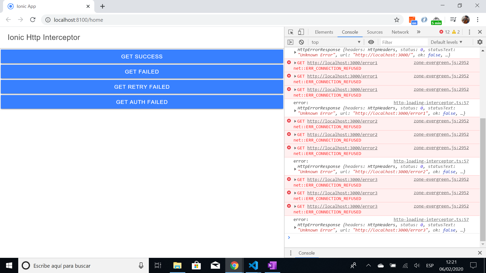

# :zap: Ionic Angular Http Interceptor

- Ionic-Angular tutorial app to experiment with a Http interceptor service.

## :page_facing_up: Table of contents

- [:zap: Ionic Angular Http Interceptor](#zap-ionic-angular-http-interceptor)
  _ [:page_facing_up: Table of contents](#pagefacingup-table-of-contents)
  _ [:books: General info](#books-general-info)
  _ [:camera: Screenshots](#camera-screenshots)
  _ [:signal_strength: Technologies](#signalstrength-technologies)
  _ [:floppy_disk: Setup](#floppydisk-setup)
  _ [:computer: Code Examples](#computer-code-examples)
  _ [:cool: Features](#cool-features)
  _ [:clipboard: Status & To-do list](#clipboard-status--to-do-list)
  _ [:clap: Inspiration](#clap-inspiration)
  _ [:envelope: Contact](#envelope-contact)

## :books: General info

- Http Interceptor to handle requests with a loading indication and retry logic.

- Http interceptors are added to the request pipeline in the providers section of `app.module.ts`.

- All code by Simon Grimm of the [Ionic Academy](https://ionicacademy.com/).

## :camera: Screenshots



## :signal_strength: Technologies

- [Ionic v5](https://ionicframework.com/)
- [Angular v10](https://angular.io/)
- [Ionic/angular v5](https://www.npmjs.com/package/@ionic/angular)

## :floppy_disk: Setup

- To start the server on _localhost://8100_ type: 'ionic serve'

## :computer: Code Examples

- helper function to handle a server 401 Unauthorized error

```typescript
private handle401Error(request: HttpRequest<any>, next: HttpHandler) {
		console.log('should refresh token');
		return this.fakeHttp.getToken().pipe(
			switchMap(res => {
				console.log('in switchmap: ', res);
				// store token
				const token = res['token'];
				request = request.clone({
					setParams: {
						token
					}
				});
				return next.handle(request);
			})
		);
	}
```

## :cool: Features

- Fake http service. Requires further coding to be fully functional.

## :clipboard: Status & To-do list

- Status: Part working

- To-do: There is missing code because it requires a subscription to the Ionic Academy to see the complete code base. I have followed the code shown in the Youtube video - see below.

## :clap: Inspiration

- [Simon Grimm, Ionic Academy Tutorial: How to Build an Ionic HTTP Loading Interceptor & Retry Logic](https://www.youtube.com/watch?v=IJWCpa_-MeU)
- [Angular 8 - Basic HTTP Authentication Tutorial & Example](https://jasonwatmore.com/post/2019/06/26/angular-8-basic-http-authentication-tutorial-example)

## :envelope: Contact

- Repo created by [ABateman](https://www.andrewbateman.org) - you are welcome to [send me a message](https://andrewbateman.org/contact)
